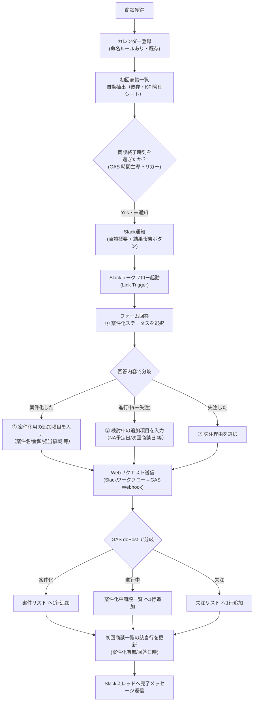

# 商談実施〜案件化 管理体制 設計書

最終更新: 2026-08-17

> **重要（取り扱い注意）**
> 本ドキュメントに登場する企業名・担当者名・メールアドレス等は**すべてダミー**です。
> 実データの検証は各自のローカル環境／権限のあるスプレッドシート上でのみ行い、
> 実在の顧客名・個人名・金額・連絡先をこの docs 配下や共有ドキュメントに書き込まないこと。

## 1. 目的

商談実施から案件化（または継続検討／失注）までの記録を、営業担当の手入力を最小限にしつつ、
抜け漏れなく `案件リスト` / `案件化中商談一覧` / `失注リスト` に振り分けて記録する。
既存の「カレンダー登録→初回商談一覧」までの自動化（KPI管理シート側）はそのまま活用し、
その後段（商談実施後の結果報告〜転記）だけを新たに自動化する。

## 2. 全体フロー



## 3. 責任分担（RACI 簡易版）

| 工程 | 実施者 | 備考 |
|---|---|---|
| 商談獲得・カレンダー登録 | 営業担当 | 既存ルールに従う（変更なし） |
| 初回商談一覧への自動反映 | GAS（既存） | 変更なし |
| 商談終了検知〜Slack通知 | GAS（新規・時間主導トリガー） | 15分間隔想定 |
| ワークフロー回答 | 営業担当 | Slack上で完結、フォーム入力のみ |
| 各シートへの転記 | GAS（新規・Webhook） | 手入力転記をゼロ化 |
| 案件化後の進捗管理 | 営業担当／マネージャー | 従来通り `案件リスト` を運用 |

## 4. シート設計

### 4.1 `初回商談一覧`（KPI管理シート・既存シートに列を追加）

既存列に加え、以下を追加する（紐付けキーが無いと後段の自動転記ができないため必須）。

| 列名 | 内容 | 追加/既存 |
|---|---|---|
| カレンダーID(紐付け用) | `カレンダー情報_raw` の一意ID をコピー | 追加 |
| 通知済みフラグ | Slack通知済みなら TRUE | 追加 |
| Slackメッセージts | スレッド返信用に保存 | 追加 |
| 案件化有無 | 案件化 / 検討中 / 失注 / （空欄=未回答） | 既存列を値のみ更新 |
| 回答日時 | ワークフロー回答が反映された日時 | 追加 |

### 4.2 `案件化中商談一覧`（案件管理シート・新規シート）

「案件化はしていないが失注でもない」商談を追跡するための一覧。`案件リスト` と列構成を近づけ、
案件化した際にそのまま `案件リスト` へ移行しやすくする。

```
案件登録日(仮) | 獲得経路 | クライアント名 | 先方担当者 | 案件名(仮) | 初回商談日 |
営業担当 | ステータス（検討中固定） | ネクストアクション日 | ネクストアクション |
次回商談日 | 案件化見込み度 | 備考 | 元カレンダーID(紐付け用)
```

### 4.3 `失注リスト`（案件管理シート・新規シート）

`案件リスト` 内の 98番台／99番台ステータスを独立させたもの。

```
記録日 | 商談実施日 | 獲得経路 | クライアント名 | 先方担当者 | 案件名(仮) |
営業担当 | 失注区分（未案件化 / 案件化後失注） | 失注理由 | 失注理由（詳細） |
元カレンダーID(紐付け用)
```

失注理由の選択肢は既存の `マスター` シートの失注理由列（時期／競合負け／予算／契約形態／業務量 等）を
Slackワークフロー側のドロップダウンにもそのまま反映する。

## 5. Slack ワークフロー設計（Slack Workflow Builder・手動設定）

GAS からは自動生成できないため、Slack 側で以下を手動設定する。

1. **ワークフロー作成**: 「商談結果報告」という名前で新規作成。
2. **トリガー**: リンクトリガー（Link Trigger）を使用。
   - 入力変数: `calendar_id`, `company_name`, `contact_name`, `sales_rep` を定義し、
     GAS が投稿するSlackメッセージのボタンURLにクエリパラメータとして埋め込む
     （例: `https://slack.com/shortcuts/xxx?calendar_id=abc123&company_name=...`）。
   - これにより営業担当は企業名等を再入力せずに済む。
3. **フォームステップ①**: 「案件化ステータス」を単一選択（案件化した / 進行中（未失注） / 失注した）。
4. **条件分岐（If/Then）**: ①の回答値で3方向に分岐し、それぞれ追加フォームを表示。
   - 案件化した → 案件名(仮) / 想定金額 / 対象業務領域 / 次回商談日
   - 進行中（未失注） → ネクストアクション / ネクストアクション日 / 次回商談日 / 案件化見込み度
   - 失注した → 失注区分 / 失注理由（マスター参照の選択肢） / 詳細メモ
5. **最終ステップ「Webリクエストを送信」**:
   - URL: GAS Web App の `/exec` URL
   - Method: POST
   - Body（JSON）: リンクトリガーの入力変数 + フォーム回答 + 共有シークレット文字列を全て含める
     （Slack側はカスタムHTTPヘッダーがGAS側で読み取れないため、認証用シークレットは
     JSONボディに含めて渡す設計とする）

## 6. GAS 実装

`../gas/` 配下に実装を置く。詳細は各ファイルのコメント参照。

- `Config.gs` : スクリプトプロパティ（Slackトークン、Webhook URL、共有シークレット、
  案件管理シートのスプレッドシートID）の読み書きヘルパー
- `NotifySlack.gs` : 時間主導トリガーで実行する `notifyCompletedFirstMeetings()`。
  `初回商談一覧` を走査し、商談終了時刻を過ぎていて未通知の行に対し Slack へ通知を送る。
- `WebhookHandler.gs` : Web App のエントリポイント `doPost(e)`。
  Slack ワークフローからの POST を受け取り、内容に応じて
  `案件リスト` / `案件化中商談一覧` / `失注リスト` のいずれかへ1行追記し、
  `初回商談一覧` の該当行を更新後、Slackスレッドへ完了メッセージを返信する。
- `SheetHelpers.gs` : シート操作の共通関数（行検索・追記・ヘッダー行からの列インデックス解決）。

### デプロイ手順（概要）

1. KPI管理シートに紐づく Apps Script プロジェクトに `NotifySlack.gs` 等を追加。
   （`案件管理シート` は別ファイルなので `SpreadsheetApp.openById(DEAL_SHEET_ID)` で開く）
2. スクリプトプロパティに以下を設定:
   - `SLACK_BOT_TOKEN`（`chat.postMessage` 用。Bot Token Scopes: `chat:write`）
   - `SLACK_CHANNEL_ID`
   - `DEAL_SHEET_ID`（案件管理シートのスプレッドシートID）
   - `SHARED_SECRET`（Slackワークフロー側と共有する任意の文字列）
   - `WORKFLOW_LINK_TRIGGER_URL`（Slack Workflow Builder で発行されるリンクトリガーURL）
3. `doPost` を含むプロジェクトを「ウェブアプリ」としてデプロイし、発行された `/exec` URL を
   Slackワークフローの「Webリクエストを送信」ステップに設定する。
4. `notifyCompletedFirstMeetings` に時間主導トリガー（15分おき等）を設定する。

## 7. 未確定・要相談事項

- `初回商談一覧` へのカレンダーID列追加は既存の自動転記処理（企業名取得等）と同じ場所で
  行われている想定だが、実際にそのロジックを書いているスクリプトの所在が未確認。
  既存スクリプトを直接拡張するか、別トリガーとして追加するかは実装時に要確認。
- Slack Bot のワークスペースへのインストール権限・チャンネルIDの確定。
- 失注理由の選択肢（マスターシート記載分）をSlackワークフロー側に転記する作業（手動）。
