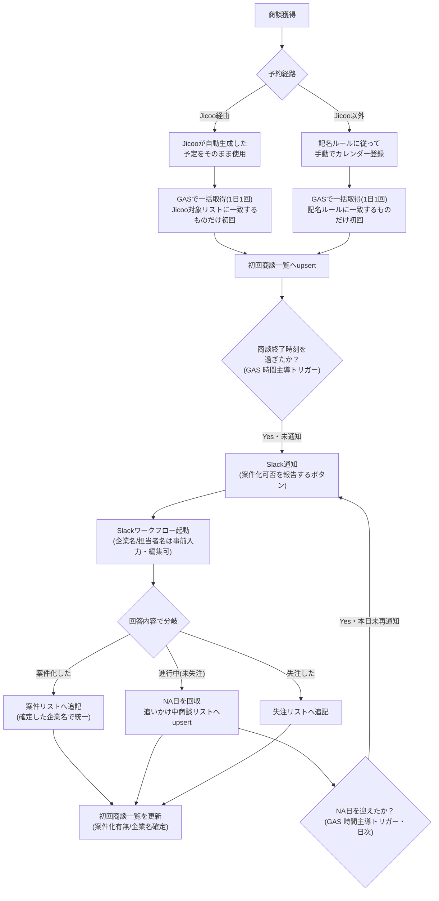

# 商談実施〜案件化 管理体制 設計書

最終更新: 2026-08-17（v2: 商談名記入運用・NA日再通知ループを反映）

> **重要（取り扱い注意）**
> 本ドキュメントに登場する企業名・担当者名・メールアドレス等は**すべてダミー**です。
> 実データの検証は各自のローカル環境／権限のあるスプレッドシート上でのみ行い、
> 実在の顧客名・個人名・金額・連絡先をこの docs 配下や共有ドキュメントに書き込まないこと。

## 1. 目的

商談実施から案件化（または継続検討／失注）までの記録を、営業担当の手入力を最小限にしつつ、
抜け漏れなく `案件リスト` / `追いかけ中商談リスト` / `失注リスト` に振り分けて記録する。
未案件化の商談は放置せず、NA日（ネクストアクション日）が来たら自動で再度案件化可否を聞き直す
ループを組み込み、追いかけ漏れを防ぐ。

## 2. 商談名記入の運用

初回商談かどうかの判定は、予約経路によって2ルートに分かれる。

| 経路 | カレンダー登録方法 | 初回判定の方法 |
|---|---|---|
| Jicoo経由 | Jicooが自動生成した予定をそのまま使う（別途登録しない） | 予定タイトルが `Jicoo対象リスト`（後述）に載っているものだけを初回とみなす |
| Jicoo以外 | 記名ルールに従って手動でカレンダーに予定名を登録する | タイトルが記名ルールの形式に一致するものだけを初回とみなし、企業名・担当者名を抽出する |

**記名ルール**: `【初回】{企業名(正式名称)}|{担当者名}様`

Jicooの予約はJicoo側のタイトルが予約ページ単位のテンプレート名（例:「AI無料相談会_26_30」）であり、
企業名・担当者名を機械的に抽出できる形式になっていない。そのため記名ルールでの代替はせず、
「大さんが管理する対象リストに載っているタイトルかどうか」で初回商談を判定する。

## 3. 全体フロー



ポイントは、**未案件化の商談がループとして「4. Slack通知」に戻ってくる**こと。
NA日を迎えるたびに同じSlackワークフローで案件化可否を聞き直し、案件化 or 失注が確定するまで
`追いかけ中商談リスト` に残り続ける。

## 4. 責任分担（RACI 簡易版）

| 工程 | 実施者 | 備考 |
|---|---|---|
| 商談獲得・カレンダー登録 | 営業担当 | Jicoo経由かどうかで登録方法が異なる（§2） |
| Jicoo対象リストの維持 | 大さん（担当者） | 新しいJicoo予約ページを追加した際に更新 |
| 初回判定・初回商談一覧への反映 | GAS（`CalendarFetch.gs`） | 1日1回、時間主導トリガー |
| 商談終了検知〜Slack通知 | GAS（`NotifySlack.gs`） | 15分間隔想定 |
| NA日到来〜再通知 | GAS（`NotifySlack.gs`） | 日次、時間主導トリガー |
| ワークフロー回答 | 営業担当 | Slack上で完結。企業名等は事前入力・編集可 |
| 各シートへの転記 | GAS（`WebhookHandler.gs`） | 手入力の転記をゼロ化 |
| 案件化後の進捗管理 | 営業担当／マネージャー | 従来通り `案件リスト` を運用 |

## 5. シート設計

### 5.1 `Jicoo対象リスト`（KPI管理シート・新規シート）

Jicoo予約のうち、どのタイトルを初回商談として扱うかを列挙する一覧。大さんが手動で維持する。

```
Jicoo予定名(対象)
```

### 5.2 `初回商談一覧`（KPI管理シート・既存シートに列を追加）

| 列名 | 内容 | 追加/既存 |
|---|---|---|
| カレンダーID(紐付け用) | Googleカレンダーの予定ID | 追加 |
| 商談ソース | `Jicoo` / `記名ルール` | 追加 |
| 企業名取得 | 自動抽出した参考値（Jicoo経由は空欄になりうる） | 既存列を利用 |
| 企業担当者名取得 | 同上 | 既存列を利用 |
| 企業名(確定) | Slackフォームで営業担当が確定させた値 | 追加 |
| 担当者名(確定) | 同上 | 追加 |
| 通知済みフラグ | Slack通知済みなら TRUE | 追加 |
| Slackメッセージts | スレッド返信用に保存 | 追加 |
| 案件化有無 | 案件化 / 検討中 / 失注 / （空欄=未回答） | 既存列を値のみ更新 |
| 回答日時 | ワークフロー回答が反映された日時 | 追加 |

### 5.3 `追いかけ中商談リスト`（案件管理シート・新規シート）

「案件化はしていないが失注でもない」商談を、NA日を軸に追跡する一覧。

```
元カレンダーID(紐付け用) | クライアント名 | 先方担当者 | 営業担当 | 初回商談日 |
ステータス（検討中 / 案件化済み(卒業) / 失注(クローズ)） | NA日 |
ネクストアクション | 案件化見込み度 | 直近通知日 | 再通知Slackメッセージts
```

NA日を迎えると `renotifyDueFollowUps()` がこの行をもとに再度Slack通知を送る。
案件化・失注が確定した際は行を削除せず、ステータスを更新しNA日を空にすることでループから外す
（履歴として残す）。

### 5.4 `失注リスト`（案件管理シート・新規シート）

```
記録日 | 商談実施日 | クライアント名 | 先方担当者 | 営業担当 |
失注区分（未案件化 / 案件化後失注） | 失注理由 | 失注理由（詳細） |
元カレンダーID(紐付け用)
```

失注理由の選択肢は既存の `マスター` シートの失注理由列をSlackワークフロー側のドロップダウンにも反映する。

## 6. Slack ワークフロー設計（Slack Workflow Builder・手動設定）

GAS からは自動生成できないため、Slack 側で以下を手動設定する。同じワークフローを
「初回のSlack通知」と「NA日到来時の再通知」の両方から起動する（起動元はGAS側で分岐しない）。

1. **ワークフロー作成**: 「商談結果報告」という名前で新規作成。
2. **トリガー**: リンクトリガー（Link Trigger）を使用。
   - 入力変数: `calendar_id`, `company_name`, `contact_name`, `sales_rep` を定義。
   - GASが投稿するSlackメッセージのボタンURLにクエリパラメータとして埋め込み、
     フォームの初期値として使う（企業名・担当者名は編集可能にしておく）。
3. **フォームステップ①**: 「案件化ステータス」を単一選択（案件化した / 進行中（未失注） / 失注した）。
   会社名・担当者名の入力欄も同じステップに含め、リンクトリガーの値を初期値としてセットする。
4. **条件分岐（If/Then）**: ①の回答値で3方向に分岐。
   - 案件化した → 案件名(仮) / 想定金額 / 対象業務領域 / 次回商談日
   - 進行中（未失注） → ネクストアクション / **NA日（必須。再通知ループの起点）** / 案件化見込み度
   - 失注した → 失注区分 / 失注理由（マスター参照の選択肢） / 詳細メモ
5. **最終ステップ「Webリクエストを送信」**:
   - URL: GAS Web App の `/exec` URL
   - Method: POST
   - Body（JSON）: リンクトリガーの入力変数 + フォーム回答（編集後の企業名・担当者名を含む）+
     共有シークレット文字列を全て含める
     （Slack側はカスタムHTTPヘッダーがGAS側で読み取れないため、認証用シークレットは
     JSONボディに含めて渡す設計とする）

## 7. GAS 実装

`../gas/` 配下に実装を置く。詳細は各ファイルのコメント参照。

- `Config.gs` : スクリプトプロパティ（Slackトークン、案件管理シートのスプレッドシートID、
  共有シークレット等）の読み書きヘルパー。
- `CalendarFetch.gs` : `collectFirstMeetings()`。想定オペレーション ステップ2-3に対応。
  カレンダーを一括走査し、Jicoo対象リストまたは記名ルールで初回商談を判定して
  `初回商談一覧` へupsertする。**Jicoo経由かどうかの判定は、予定の説明欄/場所欄に
  "jicoo" という文字列が含まれるかで仮判定している（実データで要検証、§9参照）。**
- `NotifySlack.gs` : `notifyCompletedFirstMeetings()`（商談終了検知→初回通知）と
  `renotifyDueFollowUps()`（NA日到来→再通知、ステップ6に対応）。
- `WebhookHandler.gs` : Web App のエントリポイント `doPost(e)`。
  Slack ワークフローからの POST を受け取り、内容に応じて
  `案件リスト` / `追いかけ中商談リスト` / `失注リスト` のいずれかへ反映し、
  `初回商談一覧` の企業名・担当者名を確定値で更新後、Slackスレッドへ完了メッセージを返信する。
- `SheetHelpers.gs` : シート操作の共通関数（行検索・追記・更新・upsert）。

### デプロイ手順（概要）

1. KPI管理シートに紐づく Apps Script プロジェクトに `gas/` 配下のファイルを追加。
   （`案件管理シート` は別ファイルなので `SpreadsheetApp.openById(DEAL_SHEET_ID)` で開く）
2. スクリプトプロパティに以下を設定:
   - `SLACK_BOT_TOKEN`（`chat.postMessage` 用。Bot Token Scopes: `chat:write`）
   - `SLACK_CHANNEL_ID`
   - `DEAL_SHEET_ID`（案件管理シートのスプレッドシートID）
   - `SHARED_SECRET`（Slackワークフロー側と共有する任意の文字列）
   - `WORKFLOW_LINK_TRIGGER_URL`（Slack Workflow Builder で発行されるリンクトリガーURL）
   - `SOURCE_CALENDAR_ID`（任意。走査対象カレンダーのID）
3. `doPost` を含むプロジェクトを「ウェブアプリ」としてデプロイし、発行された `/exec` URL を
   Slackワークフローの「Webリクエストを送信」ステップに設定する。
4. 3つの時間主導トリガーを設定する。
   - `collectFirstMeetings` … 1日1回
   - `notifyCompletedFirstMeetings` … 15分おき
   - `renotifyDueFollowUps` … 1日1回（`collectFirstMeetings` の後がよい）

## 8. 導入マイルストーン・スケジュール

2〜3時間/日の稼働を想定。①Jicoo対象リストの整備と④Slack Bot申請は
他部門・他担当者への依頼が絡むため最優先で着手する。

| # | マイルストーン | 目安時間 |
|---|---|---|
| ① | `Jicoo対象リスト` を作成する（大さん保有分を転記） | 1h |
| ② | 初回商談一覧・追いかけ中商談リスト・失注リストのシート構成を更新する | 1〜2h |
| ③ | `CalendarFetch.gs` を配置し、Jicoo判定条件を実データで検証・調整する | 2〜4h |
| ④ | Slack Botを作成する | 0.5〜1h（+承認待ち） |
| ⑤ | Slack Workflow Builderで「商談結果報告」を設定する（NA日ループ対応） | 2〜3h |
| ⑥ | GASコードを配置し、3つの時間主導トリガーを設定する | 1.5〜2h |
| ⑦ | 初回ループ・NA日再通知ループの両方をE2Eテストする | 3〜4h |
| ⑧ | チームへ共有・運用開始を案内する | 0.5〜1h |

| 日程 | 該当マイルストーン | 内容 |
|---|---|---|
| 8/18(火) | ①④ | Jicoo対象リスト整備＋Slack Bot作成申請 |
| 8/19(水) | ② | シート構成更新（列追加・新規3シート） |
| 8/20-21(木金) | ③ | CalendarFetch.gs配置・Jicoo判定の実データ検証 |
| 8/22-23(土日) | — | 予備 |
| 8/24(月) | ⑤ | Slack Workflow Builder設定 |
| 8/25(火) | ⑥ | GASデプロイ・トリガー設定 |
| 8/26-27(水木) | ⑦ | E2Eテスト（初回ループ／NA日再通知ループ） |
| 8/28(金) | ⑦ | 不具合修正・再テスト |
| 8/29-30(土日) | — | バッファ |
| 8/31(月) | ⑧ | チーム共有・運用開始案内 |

## 9. 未確定・要相談事項

- **Jicoo経由かどうかの判定方法が仮実装**: 予定の説明欄/場所欄に "jicoo" という文字列が
  含まれるかで判定しているが、実際のJicoo連携でこの情報が入るか未検証。入らない場合は、
  `r_jicoo` シートのような既存のJicooデータ一覧とカレンダーIDを突き合わせる方式に
  差し替える必要がある。
- Slack Bot のワークスペースへのインストール権限・チャンネルIDの確定。
- 失注理由の選択肢（マスターシート記載分）をSlackワークフロー側に転記する作業（手動）。
- `追いかけ中商談リスト` の行を物理削除せず残す設計にしているため、運用が長期化すると
  行数が増え続ける。四半期などの単位で「案件化済み/失注」行をアーカイブする運用を
  別途検討する必要がある。
