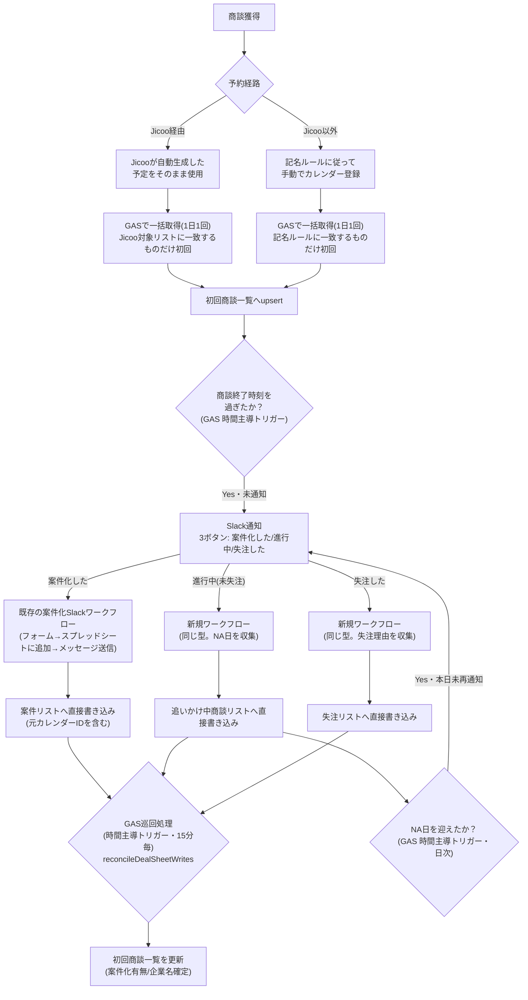

# 商談実施〜案件化 管理体制 設計書

最終更新: 2026-08-17（v5: SlackワークフローからGASへの直接POSTが使えないためPULL型に変更）

> **重要（取り扱い注意）**
> 本ドキュメントに登場する企業名・担当者名・メールアドレス等は**すべてダミー**です。
> 実データの検証は各自のローカル環境／権限のあるスプレッドシート上でのみ行い、
> 実在の顧客名・個人名・金額・連絡先をこの docs 配下や共有ドキュメントに書き込まないこと。

## 1. 目的

商談実施から案件化（または継続検討／失注）までの記録を、営業担当の手入力を最小限にしつつ、
抜け漏れなく `案件リスト` / `追いかけ中商談リスト` / `失注リスト` に振り分けて記録する。
未案件化の商談は放置せず、NA日（ネクストアクション日）が来たら自動で再度案件化可否を聞き直す
ループを組み込み、追いかけ漏れを防ぐ。

## 2. 商談名記入の運用

初回商談かどうかの判定は、予約経路によって2ルートに分かれる。

| 経路 | カレンダー登録方法 | 初回判定の方法 |
|---|---|---|
| Jicoo経由 | Jicooが自動生成した予定をそのまま使う（別途登録しない） | 予定タイトルが `Jicoo対象リスト`（後述）に載っているものだけを初回とみなす |
| Jicoo以外 | 記名ルールに従って手動でカレンダーに予定名を登録する | タイトルが記名ルールの形式に一致するものだけを初回とみなし、企業名・担当者名を抽出する |

**記名ルール**: `【初回】{企業名(正式名称)}|{担当者名}様`

Jicooの予約はJicoo側のタイトルが予約ページ単位のテンプレート名（例:「AI無料相談会_26_30」）であり、
企業名・担当者名を機械的に抽出できる形式になっていない。そのため記名ルールでの代替はせず、
「大さんが管理する対象リストに載っているタイトルかどうか」で初回商談を判定する。

## 3. 全体フロー



ポイントは3つ。

1. **ボタンの時点で3方向に分かれる**こと。案件化のケースは既存の案件化Slackワークフローへそのまま進み、
   新規に作るのは「進行中（未失注）」「失注した」の2ワークフローだけでよい。3つとも
   「フォームで収集 → スプレッドシートに追加する → メッセージを送信する」という同じ型を使う
   （既存の案件化ワークフローが既にこの型で動いている）。
2. **GASからSlackワークフローへの直接POST（Webリクエストを送信ステップ）が使えない**ため、
   書き込みはSlack側から直接行い、GASは`reconcileDealSheetWrites()`で定期的に
   3シートを巡回して`初回商談一覧`へ反映する、PULL型の構成にしている（§9参照）。
3. **未案件化の商談がループとして「4. Slack通知」に戻ってくる**こと。
   NA日を迎えるたびに同じ3ボタンで案件化可否を聞き直し、案件化 or 失注が確定するまで
   `追いかけ中商談リスト` に残り続ける。

## 4. 責任分担（RACI 簡易版）

| 工程 | 実施者 | 備考 |
|---|---|---|
| 商談獲得・カレンダー登録 | 営業担当 | Jicoo経由かどうかで登録方法が異なる（§2） |
| Jicoo対象リストの維持 | 大さん（担当者） | 新しいJicoo予約ページを追加した際に更新 |
| 初回判定・初回商談一覧への反映 | GAS（`CalendarFetch.gs`） | 1日1回、時間主導トリガー |
| 商談終了検知〜Slack通知 | GAS（`NotifySlack.gs`） | 15分間隔想定 |
| NA日到来〜再通知 | GAS（`NotifySlack.gs`） | 日次、時間主導トリガー |
| ワークフロー回答・各シートへの書き込み | 営業担当／Slackワークフロー | フォーム回答をワークフローが直接スプレッドシートへ追加 |
| 商談DBへの反映 | GAS（`ReconcileDealSheets.gs`） | 15分毎、時間主導トリガー。3シートを巡回して商談DBを更新 |
| 案件化後の進捗管理 | 営業担当／マネージャー | 従来通り `案件リスト` を運用 |

## 5. シート設計

### 5.1 `Jicoo対象リスト`（KPI管理シート・新規シート）

Jicoo予約のうち、どのタイトルを初回商談として扱うかを列挙する一覧。大さんが手動で維持する。

```
Jicoo予定名(対象)
```

### 5.2 `案件リスト`（案件管理シート・既存シートに列を追加）

既存の案件化ワークフローが書き込んでいるシート。商談DBとの紐付けのため1列だけ追加する。

```
（既存の列はそのまま） | 元カレンダーID(紐付け用)
```

### 5.3 `初回商談一覧`（KPI管理シート・既存シートに列を追加）

| 列名 | 内容 | 追加/既存 |
|---|---|---|
| カレンダーID(紐付け用) | Googleカレンダーの予定ID | 追加 |
| 商談ソース | `Jicoo` / `記名ルール` | 追加 |
| 企業名取得 | 自動抽出した参考値（Jicoo経由は空欄になりうる） | 既存列を利用 |
| 企業担当者名取得 | 同上 | 既存列を利用 |
| 企業名(確定) | Slackフォームで営業担当が確定させた値 | 追加 |
| 担当者名(確定) | 同上 | 追加 |
| 通知済みフラグ | Slack通知済みなら TRUE | 追加 |
| 案件化有無 | 案件化 / 検討中 / 失注 / （空欄=未回答） | 既存列を値のみ更新 |
| 回答日時 | ワークフロー回答が反映された日時 | 追加 |

### 5.4 `追いかけ中商談リスト`（案件管理シート・新規シート）

「案件化はしていないが失注でもない」商談を、NA日を軸に追跡する一覧。

```
元カレンダーID(紐付け用) | クライアント名 | 先方担当者 | 営業担当 | 初回商談日 |
ステータス（検討中 / 案件化済み(卒業) / 失注(クローズ)） | NA日 |
ネクストアクション | 案件化見込み度 | 直近通知日
```

NA日を迎えると `renotifyDueFollowUps()` がこの行をもとに再度Slack通知を送る。
案件化・失注が確定した際は行を削除せず、ステータスを更新しNA日を空にすることでループから外す
（履歴として残す）。

### 5.5 `失注リスト`（案件管理シート・新規シート）

```
記録日 | 商談実施日 | クライアント名 | 先方担当者 | 営業担当 |
失注区分（未案件化 / 案件化後失注） | 失注理由 | 失注理由（詳細） |
元カレンダーID(紐付け用)
```

失注理由の選択肢は既存の `マスター` シートの失注理由列をSlackワークフロー側のドロップダウンにも反映する。

## 6. Slack ワークフロー設計（Slack Workflow Builder・手動設定）

**このワークスペースのSlackプランでは「Webリクエストを送信」ステップ（ワークフロー→外部への直接POST）が
使えない**ことが判明したため、GASへのPUSHはあきらめ、**Slack側が直接スプレッドシートに書き込み、
GASがそれを後から拾いに行くPULL型**にした（既存の案件化ワークフローがすでにこの型で動いており、
それに合わせる形になる）。

どのワークフローも同じ3ステップの型:

1. **情報をフォームで収集する** — 企業名・担当者名（リンクトリガーの値を初期値にして編集可）、
   その他ステータスに応じた項目
2. **スプレッドシートに追加する** — 対象シートへ直接1行追加。**`元カレンダーID(紐付け用)` 列に
   リンクトリガーの `calendar_id` 変数をマッピングすることが必須**（GASが商談DBと突き合わせるキーになる）
3. **メッセージを送信する** — チャンネルへ完了報告（例: 「✅ {{企業名}} を記録しました」）

### 6.1 既存の「案件化」ワークフローへの追加設定

すでにこの3ステップ型で `案件リスト` へ書き込んでいる。変更は2点だけでよい。

1. リンクトリガーの入力変数に `calendar_id` を追加する
   （GASが投稿するSlackメッセージの「案件化した」ボタンURLに
   `calendar_id` / `company_name` / `contact_name` / `sales_rep` がクエリパラメータで付いてくる。
   §7 `EXISTING_DEAL_WORKFLOW_URL` 参照）。
2. 「2. スプレッドシートに追加する」ステップで、`案件リスト` に新設した
   `元カレンダーID(紐付け用)` 列に `{{calendar_id}}` をマッピングする。

### 6.2 新規ワークフロー（進行中／失注）

既存ワークフローと同じ3ステップ型で、独立したワークフローを2つ作る
（If/Thenでの分岐は不要。ボタンごとに別ワークフローなので迷わない）。

**進行中（未失注）用**
1. リンクトリガーの入力変数: `calendar_id`, `company_name`, `contact_name`, `sales_rep`。
2. フォーム: 企業名・担当者名（初期値をリンクトリガーの値にし編集可能）、ネクストアクション、
   **NA日（必須。再通知ループの起点）**、案件化見込み度。
3. 「スプレッドシートに追加する」: `追いかけ中商談リスト` へ、`元カレンダーID(紐付け用)` に
   `{{calendar_id}}` を含めて追加。
4. 「メッセージを送信する」で完了報告（例: 「📝 {{企業名}} を追いかけ中商談リストに記録しました」）。

**失注した用**
1. リンクトリガーの入力変数: `calendar_id`, `company_name`, `contact_name`, `sales_rep`。
2. フォーム: 企業名・担当者名、失注区分、失注理由（マスター参照の選択肢）、詳細メモ。
3. 「スプレッドシートに追加する」: `失注リスト` へ、`元カレンダーID(紐付け用)` に
   `{{calendar_id}}` を含めて追加。
4. 「メッセージを送信する」で完了報告（例: 「📕 {{企業名}} を失注リストに記録しました」）。

## 7. GAS 実装

`../gas/` 配下に実装を置く。詳細は各ファイルのコメント参照。Web Appのデプロイは不要
（GASへの直接POSTを受け取らないため）。

- `Config.gs` : スクリプトプロパティ（Incoming Webhook URL、案件管理シートのスプレッドシートID等）
  の読み書きヘルパー。
- `CalendarFetch.gs` : `collectFirstMeetings()`。想定オペレーション ステップ2-3に対応。
  既存の `syncCalendarToSheet()`（カレンダー情報_raw への転記。他のKPI集計が依存しているため
  変更しない）と同じカレンダー走査パターンをベースに、初回商談一覧専用に書き直したもの。
  トップレベルの変数・関数名は既存スクリプトと同じApps Scriptプロジェクトに同居しても
  衝突しないよう別名にしている。Jicoo経由かどうかは、予定の説明欄に "Powered by Jicoo" を
  含むかで判定する（既存スクリプトの実データで確認済みの条件）。
- `NotifySlack.gs` : `notifyCompletedFirstMeetings()`（商談終了検知→初回通知）と
  `renotifyDueFollowUps()`（NA日到来→再通知、ステップ6に対応）。Incoming Webhookで送信する。
- `ReconcileDealSheets.gs` : `reconcileDealSheetWrites()`。想定オペレーション ステップ5〜6（反映側）に対応。
  `案件リスト` / `追いかけ中商談リスト` / `失注リスト` を`元カレンダーID(紐付け用)`で巡回し、
  一致する `初回商談一覧` の行を企業名・担当者名の確定値と案件化有無で更新する。
  案件化・失注が確定した場合は `追いかけ中商談リスト` 側の該当行もクローズする。
- `SheetHelpers.gs` : シート操作の共通関数（行検索・追記・更新・upsert）。

### デプロイ手順（概要）

1. KPI管理シートに紐づく Apps Script プロジェクトに `gas/` 配下のファイルを追加。
   （`案件管理シート` は別ファイルなので `SpreadsheetApp.openById(DEAL_SHEET_ID)` で開く）
2. スクリプトプロパティに以下を設定:
   - `SLACK_INCOMING_WEBHOOK_URL`（通知先チャンネルに紐づくIncoming WebhookのURL）
   - `DEAL_SHEET_ID`（案件管理シートのスプレッドシートID）
   - `EXISTING_DEAL_WORKFLOW_URL`（既存の「案件化」ワークフローのリンクトリガーURL）
   - `WORKFLOW_LINK_TRIGGER_URL_INPROGRESS`（新規「進行中」ワークフローのリンクトリガーURL）
   - `WORKFLOW_LINK_TRIGGER_URL_LOST`（新規「失注」ワークフローのリンクトリガーURL）
   - `SOURCE_CALENDAR_ID`（任意。走査対象カレンダーのID）
3. 4つの時間主導トリガーを設定する。
   - `collectFirstMeetings` … 1日1回
   - `notifyCompletedFirstMeetings` … 15分おき
   - `renotifyDueFollowUps` … 1日1回（`collectFirstMeetings` の後がよい）
   - `reconcileDealSheetWrites` … 15分おき

## 8. 導入マイルストーン・スケジュール

2〜3時間/日の稼働を想定。①Jicoo対象リストの整備は他担当者への依頼が絡むため最優先で着手する。
④はSlack Botではなく発行済みのIncoming Webhook URLを使うため、確認のみで完了する想定。
Web Appのデプロイは不要になった。

| # | マイルストーン | 目安時間 |
|---|---|---|
| ① | `Jicoo対象リスト` を作成する（大さん保有分を転記） | 1h |
| ② | 初回商談一覧・案件リスト・追いかけ中商談リスト・失注リストのシート構成を更新する | 1〜2h |
| ③ | `CalendarFetch.gs` を配置し、Jicoo判定条件を実データで検証・調整する | 2〜4h |
| ④ | Incoming Webhook URLを確認する（発行済み） | 0.1h |
| ⑤ | Slack Workflow Builderを設定する：既存の案件化ワークフローへ2点の変更＋新規「進行中」「失注」ワークフローを作成 | 2〜3h |
| ⑥ | GASコードを配置し、4つの時間主導トリガーを設定する | 1〜1.5h |
| ⑦ | 初回ループ・NA日再通知ループの両方をE2Eテストする | 3〜4h |
| ⑧ | チームへ共有・運用開始を案内する | 0.5〜1h |

| 日程 | 該当マイルストーン | 内容 |
|---|---|---|
| 8/18(火) | ①④ | Jicoo対象リスト整備＋Incoming Webhook URL確認 |
| 8/19(水) | ② | シート構成更新（列追加・新規3シート） |
| 8/20-21(木金) | ③ | CalendarFetch.gs配置・Jicoo判定の実データ検証 |
| 8/22-23(土日) | — | 予備 |
| 8/24(月) | ⑤ | Slack Workflow Builder設定 |
| 8/25(火) | ⑥ | GASデプロイ・トリガー設定 |
| 8/26-27(水木) | ⑦ | E2Eテスト（初回ループ／NA日再通知ループ） |
| 8/28(金) | ⑦ | 不具合修正・再テスト |
| 8/29-30(土日) | — | バッファ |
| 8/31(月) | ⑧ | チーム共有・運用開始案内 |

## 9. 未確定・要相談事項

- **Slackワークフロー→GAS の直接POSTが使えない**ことが判明したため、PULL型（GASが定期的に
  スプレッドシートを巡回）に変更した。反映の即時性はWebhook方式より落ちる（最大15分程度のラグ）。
  即時性が必要になった場合、有料プランへの変更や別の連携方法（Apps Script製Slack Appのカスタムステップ等）
  を検討する。
- **既存の案件化ワークフローの編集権限者との調整**: `calendar_id` 入力変数の追加と、
  「スプレッドシートに追加する」ステップでの `元カレンダーID(紐付け用)` 列マッピング追加を、
  編集権限を持つ人に依頼する必要がある。
- 失注理由の選択肢（マスターシート記載分）をSlackワークフロー側に転記する作業（手動）。
- `追いかけ中商談リスト` の行を物理削除せず残す設計にしているため、運用が長期化すると
  行数が増え続ける。四半期などの単位で「案件化済み/失注」行をアーカイブする運用を
  別途検討する必要がある。
